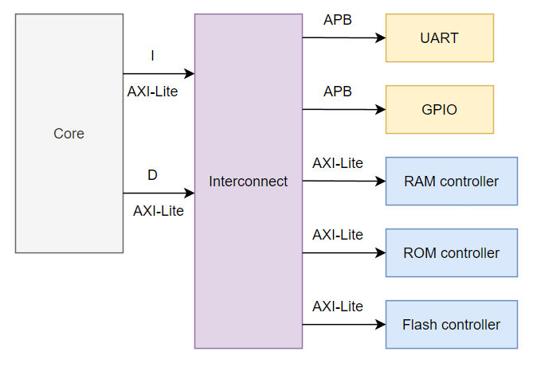
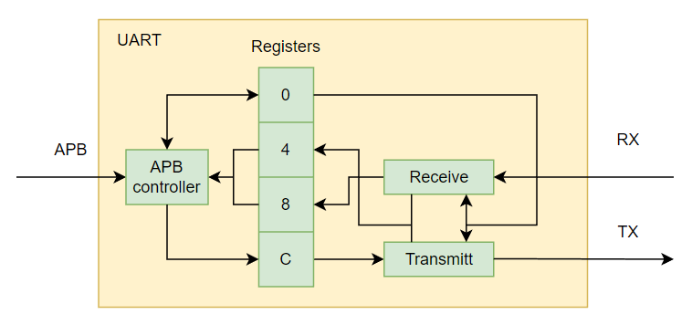
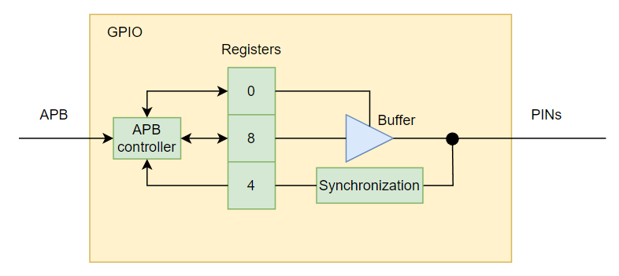
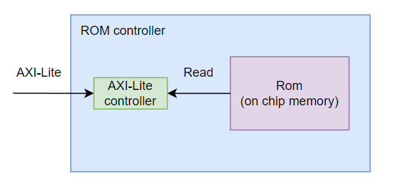

# Учебная система на кристалле

## Общее описание
Система состоит из ряда модулей, написанных на языке SystemVerilog и реализует простую систему на кристалле (SoC) микроконтроллерного класса. Программма сохраняется на внешнем носителе и после подачи питания переносится в ОЗУ, после чего начинает выполняться. Предполагается запуск как в симуляторе(Modelsim), так и на FPGA (Altera DE2-115)

Общая схема модуля

Разрабатываемые компоненты:
* UART - модуль приемопередатчика UART
* GPIO - модуль для управления портами ввода-вывода
* RAM - контроллер оперативной памяти
* ROM - контроллер ПЗУ, содержащей начальный загрузчик
* Flash - контролллер памяти, которая содержит исполняемую программу

## Карта памяти

| Диапазон                  | Описание                                            |
| ------------------------- | --------------------------------------------------- |
| 0x8000_0000 - 0x8fff_ffff | Основная память (RAM)                               |
| 0x9000_0000 - 0x90ff_ffff | ROM память                                          |
| 0x9100_0000 - 0x91ff_ffff | Flash память                                        |
| 0x9200_0000 - 0x92ff_ffff | Периферия - UART                                    |
| 0x9300_0000 - 0x93ff_ffff | Периферия - GPIO                                    |

## Регистры блока UART

| Адрес         | Имя           | Описание                          |
| ------        | ----          | -------------                     |
| 0x9200_0000   | UART_CONTROL  | [RW] UART Configuration Register  |
| 0x9200_0004   | UART_STATUS   | [R] UART Status Register          |
| 0x9200_0008   | UART_RX       | [R] UART Data Register            |
| 0x9200_000C   | UART_TX       | [W] UART Data Register            |

Схема блока

## Регистры блока GPIO

| Адрес         | Имя               | Описание                      |
| ------        | ----              | -------------                 |
| 0x9300_0000   | GPIO_DIRECTION    | [RW] Configuration Register   |
| 0x9300_0004   | GPIO_INPUT        | [R] GPIO Input Status         |
| 0x9300_0008   | GPIO_OUTPUT       | [RW] GPIO Output Control      |

Схема блока

## ROM controller
Схема блока
